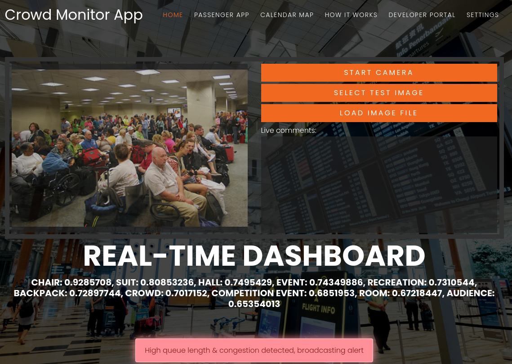
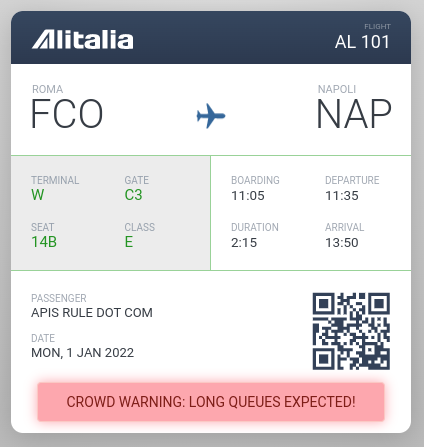
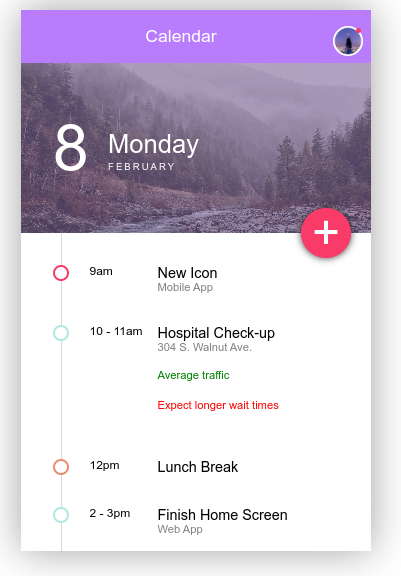
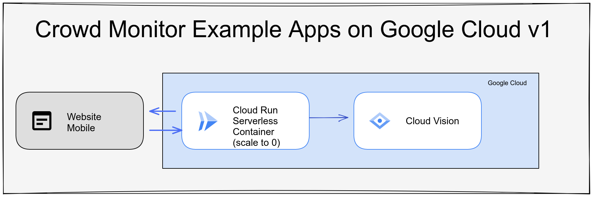
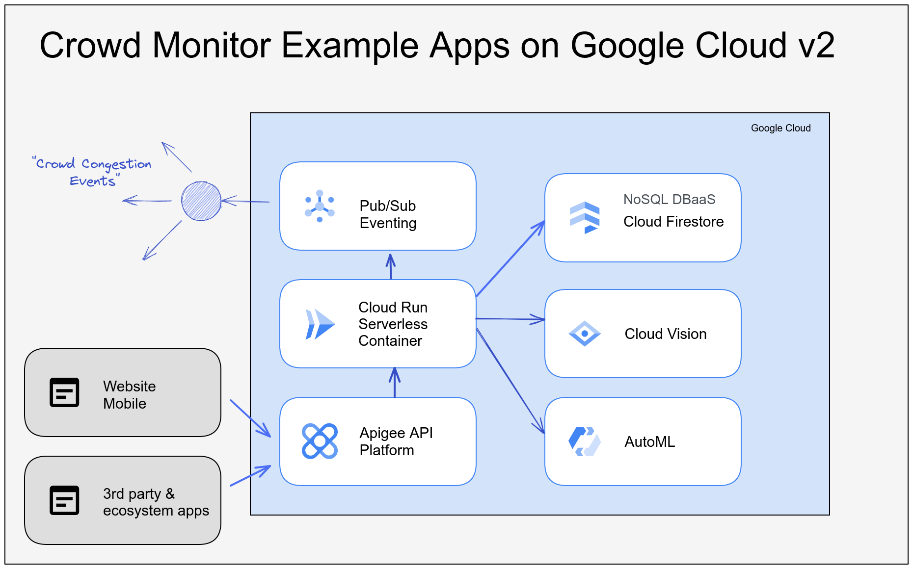

# Crowd Monitoring Example Apps on Google Cloud

This is a series of demo apps using [Google Cloud Serverless](https://cloud.google.com/serverless) and [Google Cloud AI](https://cloud.google.com/products/ai) services to monitor and recognize crowds in public spaces, and broadcast alerts accordingly to users who might be in transit and benefit from knowing about the current crowd dynamics.

This could be useful in scenarios like:
* Airport security checkpoints
* Hospital and clinic waiting rooms
* Vaccine distribution centers
* Public sector waiting rooms such as at the DMV (Department of Motor Vehicles)
* Amusement park ride lines
* Entrance to events / movie theaters
* And so many more!

## Usage Guide

The central app is the Public Spaces manager app, which can monitor and analyze video footage using [Google Cloud Vision API](https://cloud.google.com/vision). You can open a publicly deployed version of the apps [here](https://publicspaces-utbzvczbya-ew.a.run.app/).

[Crowd Monitor Apps](https://publicspaces-utbzvczbya-ew.a.run.app/).

The link above takes you to the menu of apps - click on **Manager** to open the Manager app to monitor congestion, as well as the **Passenger** app to get alerts broadcast when congestion is detected.

You can either click "Start Camera" to use your computer's webcam to get live video footage, or click "Select Test Image" to select from pre-loaded images to analyze. You can also upload your own images with "Load Image File". The result of the image analysis is then displayed, along with a warning if crowd congestion was detected.

You can open the [passenger app (for an airline example)](https://publicspaces-utbzvczbya-ew.a.run.app/apps/passenger) or the [calendar app (for a hospital example)](https://publicspaces-utbzvczbya-ew.a.run.app/apps/calendar) from the header at the top of the screen. Each app should reflect the crowd status accordingly via live events.

[Airline passenger app](https://publicspaces-utbzvczbya-ew.a.run.app/apps/passenger)

[Hospital calendar app](https://publicspaces-utbzvczbya-ew.a.run.app/apps/calendar)

## Deploy
You can easily deploy this solution in your GCP project by clicking this button (launches wizard to deploy the sample Transport Manager & Airline Apps to the serverless GCP Cloud Run service):

## Architecture

The first version of the apps use Google Cloud Run to run the code (scale to 0, no costs when there's no traffic!), and the [Google Cloud Vision API](https://cloud.google.com/vision) for crowd analysis. Events are broadcast to the clients using simple Server-Side Events (no polling!).

Version 2 of the architecture (WiP) would scale up to use [Pub/Sub](https://cloud.google.com/pubsub) for eventing and streaming data events, and [Apigee API Management](https://cloud.google.com/apigee) to scale the API consumption and integration with 3rd party developers. Also AutoML vision could be used to tailor the crowd recognition for specialized environments / lighting / sample images.

## References
- Awesome timeline codepen: https://codepen.io/abisz/pen/qaEOEm
- Awesome boarding pass codepen: https://codepen.io/supah/pen/eZdxXM

## Feedback

Feel free to add an issue / feature request.
