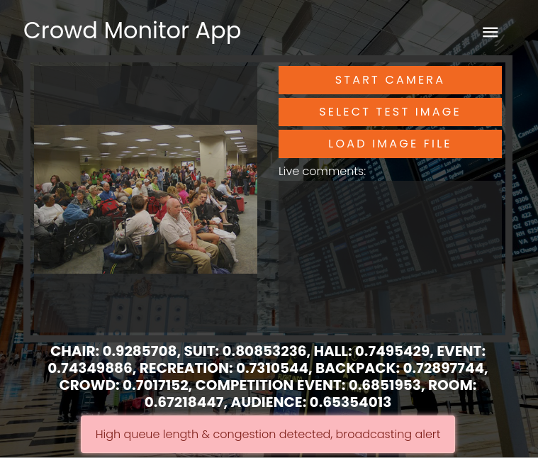

# Crowd Monitoring Example Apps on Google Cloud

This is a series of demo apps using [Google Cloud Vision API](https://cloud.google.com/vision) to monitor and recognize crowds in public spaces, and broadcast alerts accordingly to users who might be in transit and benefit from knowing about the current crowd dynamics.

This could be useful in scenarios like:
* Airport security checkpoints
* Hospital waiting rooms
* Vaccine distribution centers
* Public sector waiting rooms such as at the DMV (Department of Motor Vehicles)
* Amusement park ride lines
* Entrance to events / movie theaters
* And so many more!

## Usage Guide

The central app is the Public Spaces manager app, which can monitor and analyze video footage using [Google Cloud Vision API](https://cloud.google.com/vision). You can open a publicly deployed version of the app [here](https://crowds.tinyapps.cloud/apps/manager).

[Crowd Monitor App](https://crowds.tinyapps.cloud/apps/manager).

You can either click "Start Camera" to use your computer's webcam to get live video footage, or click "Select Test Image" to select from pre-loaded images to analyze. You can also upload your own images with "Load Image File". The result of the image analysis is then displayed, along with a warning if crowd congestion was detected.

You can open the [passenger app (for an airline example)](https://crowds.tinyapps.cloud/apps/passenger) or the [calendar app (for a hospital example)](https://crowds.tinyapps.cloud/apps/calendar) from the header at the top of the screen. Each app should reflect the crowd status accordingly via live events.

[Airline passenger app](https://crowds.tinyapps.cloud/apps/passenger)

[Hospital calendar app](https://crowds.tinyapps.cloud/apps/calendar)

## Architecture

Google Cloud Run is used for easy serverless deployment of the apps, with Firestore used as simply DbaaS, and Cloud Vision API / AutoML used for image analysis of congestion patterns.

## Deploy
You can easily deploy this solution in your GCP project by clicking this button (launches wizard to deploy the sample Transport Manager & Airline Apps to the serverless GCP Cloud Run service):

## References
- Awesome timeline codepen: https://codepen.io/abisz/pen/qaEOEm
- Awesome boarding pass codepen: https://codepen.io/supah/pen/eZdxXM

## Feedback

Feel free to add an issue / feature request.
